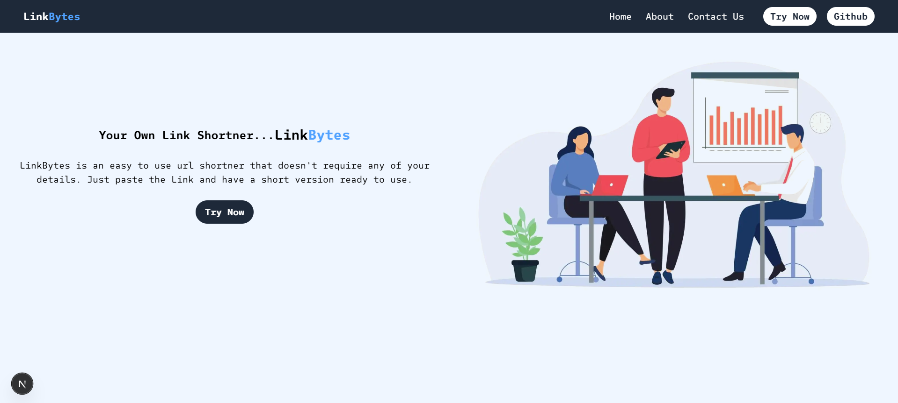
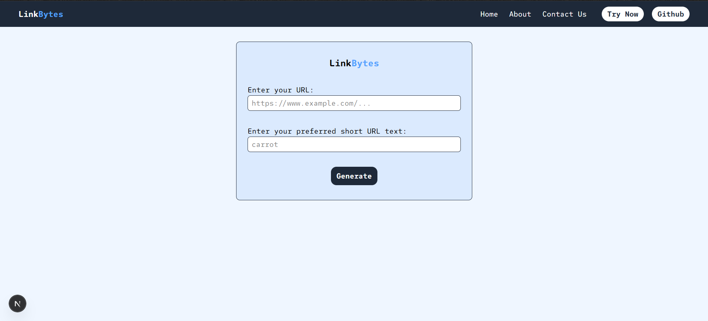

# 🔗LinkBytes
LinkBytes is a url Shortner made using NEXTJS and MongoDB.

---

## Snspshots





---

## ⚙️ Installation & Setup

### 1. Clone the repository
```bash
git clone https://github.com/Daksh-Official/linkbytes.git
cd linkbytes
```
### 2. Install dependencies
```bash
npm install
# or
yarn install
```
### 3. Setup Enviorment Variables in .env.local
### 4. Start the Server
```bash
npm run dev
```

---

🤝 Contributing

Pull requests are welcome! If you'd like to make major changes, please open an issue first to discuss.

Made by Daksh
